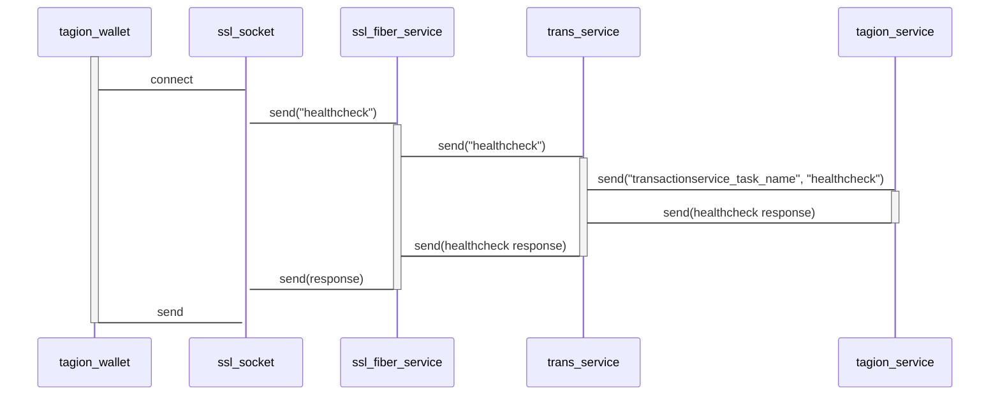

# ServerAPI

```mermaid
sequenceDiagram


activate tagion_wallet
tagion_wallet -> ssl_socket : connect
activate ssl_socket
ssl_socket -> ssl_fiber_service : send("healthcheck")
activate ssl_fiber_service
ssl_fiber_service -> trans_service : send("healthcheck")
activate trans_service
trans_service -> tagion_service: send("transactionservice_task_name", "healthcheck")
activate tagion_service
tagion_service -> trans_service: send(healthcheck response)
deactivate tagion_service
trans_service -> ssl_fiber_service: send(healthcheck response)
deactivate trans_service
ssl_fiber_service -> ssl_socket: send(response)
deactivate ssl_fiber_service
ssl_socket -> tagion_wallet: send
deactivate tagion_wallet
```
